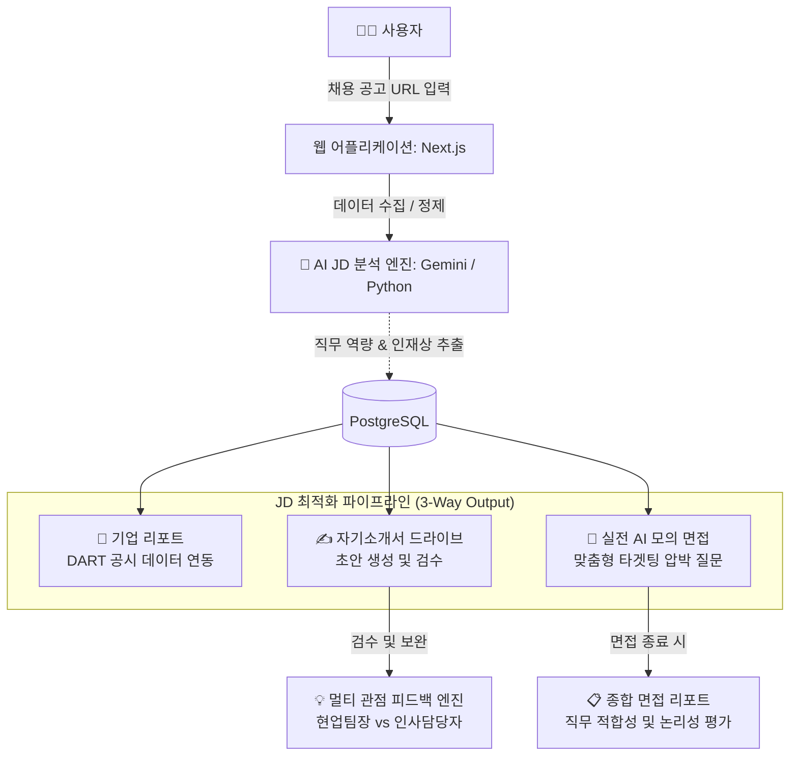

# 🚀 Job AI Assist: AI-Powered JD Optimizer & Resume Builder
> **구인공고 분석부터 실전 AI 모의 면접까지, 구직의 모든 과정을 최적화하는 AI 전략 솔루션**

Job AI Assist는 채용 시장 내 정보 비대칭성을 해소하고, 공고 분석부터 최종 지원까지의 **사용자 경험 마찰(UX Friction)**을 최소화하는 것을 목표로 하는 AI 기반 채용 최적화 플랫폼입니다. 단순한 기능 구현을 넘어 **"근거 중심·검증 우선·모호성 제거"**라는 3대 원칙 하에 데이터 정합성을 확보한 합격 전략을 제시합니다.

---

## 📌 1. 프로젝트 주요 기능 (Key Features)

기존의 단순 키워드 매칭을 넘어, AI가 사용자의 데이터를 정밀 분석하여 서류 합격부터 면접까지의 성공 확률을 극대화합니다.

* **AI-driven JD 분석:** URL 입력만으로 기술 스택(Hard Skills)과 조직 문화(Soft Skills)를 정밀 분석합니다.
* **Contextual 기업 분석 리포트:** DART 공시 데이터와 실시간 뉴스를 병렬 수집하여 기업의 재무 건전성 및 최신 동향을 포함한 5~6페이지 분량의 상세 리포트를 생성합니다.
* **전략적 자소서 최적화:** CoT(Chain of Thought) 에이전트를 통해 사용자의 경험 자산과 JD를 매칭하여 최적화된 초안 생성 및 멀티 관점(현업/인사) 피드백을 제공합니다.
* **실전형 AI 모의 면접:** 작성한 자소서와 지원 공고를 바탕으로 AI 면접관과 실시간 음성 인터랙션을 진행하며, 논리적 허점을 파고드는 맞춤형 압박 질문을 제공합니다.
* **데이터 기반 정밀 평가:** 면접 종료 후 답변의 일관성과 직무 적합성을 분석한 실전 리포트를 생성합니다.

---

## ⚙️ 2. 서비스 아키텍처 및 유저 플로우

### 🔄 신뢰 중심의 3단계 온보딩 로직
본 서비스는 AI의 할루시네이션을 방지하고 사용자 신뢰도를 높이기 위해 독자적인 **'신뢰 설계 플로우'**를 따릅니다.

1.  **Context Anchoring (URL 입력):** 공고 URL 하나로 기업과 직무의 맥락을 즉시 파악.
2.  **Logic Gate (Evaluation):** AI가 추출한 핵심 키워드를 유저가 직접 검증하여 분석의 정합성 확보.
3.  **Situation Room (전략 상황실):** 검증된 데이터를 기반으로 리포트, 자소서, 면접 준비를 통합 수행.

### 🏗 통합 데이터 파이프라인




---

## 📂 3. 디렉토리 구조 (Repository Structure)

```text
Job_AI_Assistant/
├── app/                  # Next.js App Router (페이지, UI 및 API 라우트)
│   ├── api/              # 백엔드 API 엔드포인트 (분석, 워크스페이스, 모의 면접 파이프라인)
│   ├── dashboard/        # 메인 대시보드 화면 및 하위 컴포넌트
│   ├── interview/        # AI 모의 면접 화면 및 상태/음성 제어 로직
│   └── globals.css       # 디자인 시스템 및 글로벌 스타일링
├── company_info/         # 기업 식별 및 DART 데이터 수집 파이프라인 (Python)
├── lib/                  # 공통 유틸리티 모음 (Prisma DB 클라이언트, 인증 등)
├── prisma/               # 데이터베이스 ORM 스키마 (schema.prisma) 및 마이그레이션
├── public/               # 아이콘 및 기타 정적 애셋 (Static Assets)
├── scripts/              # AI 핵심 두뇌 (Gemini 프롬프트 엔지니어링 및 평가 스크립트)
├── middleware.ts          # 라우팅 보호 및 인증된 사용자 권한 제어
├── package.json          # 전체 의존성 라이브러리 및 실행 스크립트
└── README.md             # 프로젝트 소개 문서
```

---

## 🧠 4. 핵심 모듈 상세 (Core Modules)

### ✅ AI 정밀 모의 면접 (AI Mock Interview)
* **실시간 음성 인터랙션:** Web Speech API(TTS/STT)를 활용한 리얼타임 인터뷰 환경 조성.
* **Contextual Questioning:** 사용자의 자소서와 JD의 기술 스택을 Cross-referencing하여 논리적 허점을 파고드는 정교한 질문 생성.
* **Consistency Score:** 면접 종료 후 Gemini 2.0 Flash 모델이 답변의 일관성과 핵심 강점/보완점을 도출.

### ✅ 멀티 관점 피드백 엔진 (Dual Feedback)
* **실무담당자 관점(Practitioner):** 기술 스택 매칭률 및 프로젝트 수행 역량 중심 평가.
* **인사담당자 관점(HR):** 인재상, 핵심 가치 기반의 조직 적합도(Cultural Fit) 및 논리 구조 평가.

---

## 🛠️ 5. 기술 스택 (Technical Stack)

* **Frontend:** Next.js 15, React, TailwindCSS, Framer Motion
* **Backend:** Next.js API Routes (Route Handlers)
* **AI Engine:** Google Gemini 2.0 Flash (LMM), Python 3.x (Orchestration)
* **Database:** PostgreSQL (Supabase), Prisma ORM
* **Real-time Voice:** Web Speech API (SpeechRecognition & SpeechSynthesis)
* **Authentication:** NextAuth.js

---

## 📈 6. 향후 고도화 로드맵 (Roadmap)

### 1단계: 시스템 안정화 (Short-term)
* **정합성 검증:** Supabase 스키마와 API 코드 간의 데이터 정합성 전수 조사 및 최적화.
* **프롬프트 튜닝:** 평가 로그 수집을 통한 에이전트별 파라미터 미세 조정.

### 2단계: UX 확장 및 케어 (Mid-term)
* **페르소나 정밀화:** 직무별/경력별 특화 '방어 논리' DB 구축.
* **심리적 케어 루프:** 불합격 시 AI가 자소서를 재분석하여 동기 부여형 피드백을 생성하는 기능 추가.

### 3단계: 기술 혁신 및 비즈니스 확장 (Long-term)
* **멀티모달 통합:** 포트폴리오 내 시각적 자산(그래프, 디자인)을 인식하는 AI 분석 엔진 도입.
* **B2B 확장:** 기업 인사팀이 역량 히트맵 데이터를 활용해 인재를 찾는 역매칭 시스템 제안.

---

## 📑 7. 시작하기 (Getting Started)

### 환경 변수 설정 (.env)
```env
DATABASE_URL=your_postgresql_url
DIRECT_URL=your_direct_url
NEXTAUTH_SECRET=your_secret
GOOGLE_API_KEY=your_gemini_api_key
```

### 설치 및 실행
```bash
# 의존성 설치
npm install

# Prisma 클라이언트 생성
npx prisma generate

# 개발 서버 실행
npm run dev
```

---

## 📈 프로젝트 성과 및 차별점
본 솔루션은 단순한 텍스트 생성을 넘어 **'데이터 정합성'**에 집중합니다. 사용자의 과거 경험 데이터와 지원하려는 공고 사이의 논리적 연결 고리를 AI가 검증함으로써, 인위적이지 않고 설득력 있는 지원 전략을 제시합니다.

---
© 2026 Job AI Assist Project Team. All rights reserved.
