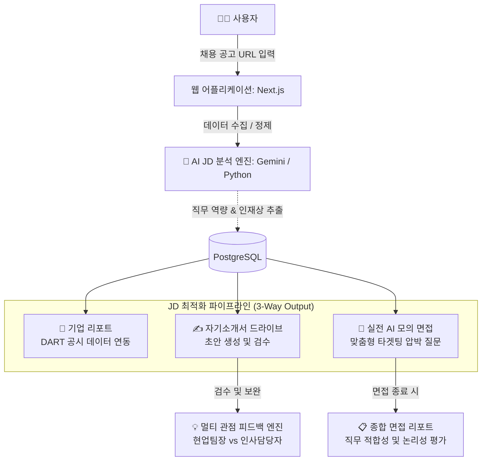

# 🚀 AI-Powered JD Optimizer & Resume Builder
> **구인공고 분석부터 실전 AI 모의 면접까지, 구직의 모든 과정을 최적화하는 AI 솔루션**

본 프로젝트는 채용 시장의 정보 비대칭성을 해소하고, 공고 분석부터 최종 면접 준비까지의 **사용자 경험 마찰(UX Friction)**을 최소화하는 것을 목표로 하는 AI 기반 채용 최적화 솔루션입니다.

---

## 📌 1. 프로젝트 주요 기능 (Key Features)

기존의 단순 키워드 매칭을 넘어, AI가 사용자의 데이터를 정밀 분석하여 서류 합격부터 면접까지의 성공 확률을 극대화합니다.

*   **AI-driven JD 분석:** URL 입력만으로 기술 스택(Hard Skills)과 조직 문화(Soft Skills)를 정밀 분석합니다.
*   **전략적 자소서 최적화:** 기업 분석 리포트와 연동하여 직무 역량에 최적화된 자소서 초안 생성 및 인사담당자 관점의 피드백을 제공합니다.
*   **실전형 AI 모의 면접 (New):** 실제 작성한 자소서와 지원 공고를 바탕으로 AI 면접관과 실시간 음성 인터랙션을 진행합니다.
*   **데이터 기반 정밀 평가:** 면접 종료 후 답변의 일관성과 직무 적합성을 분석하여 실전 리포트를 생성합니다.

---

## ⚙️ 2. 서비스 아키텍처 및 유저 플로우

시스템은 사용자의 데이터 보유 상태에 따라 유연하게 대응하며, 모든 경로는 **JD 분석 엔진**을 관통합니다.

### 🔄 통합 데이터 파이프라인



1.  **Output A (자소서 센터):** 직무 역량 기반 가이드라인 도출 및 초안 작성 보조.
2.  **Output B (기업 리포트):** 회사의 주요 사업 개요 및 관련 데이터를 시각화한 리포트 제공.
3.  **Output C (모의 면접):** 공고와 자소서를 Cross-referencing한 맞춤형 압박 면접 진행.

---

## 📂 3. 디렉토리 구조 (Repository Structure)

```text
Job_AI_Assistant/
├── app/                  # Next.js App Router (페이지, UI 및 API 라우트)
│   ├── api/              # 백엔드 API 엔드포인트 (분석, 워크스페이스, 모의 면접 파이프라인)
│   ├── dashboard/        # 메인 대시보드 화면 및 하위 컴포넌트
│   ├── interview/        # AI 모의 면접 화면 및 상태/음성 제어 로직
│   └── globals.css       # 디자인 시스템 및 글로벌 스타일링
├── company_info/         # 기업 식별 및 DART 데이터 수집 파이프라인 (Python)
├── lib/                  # 공통 유틸리티 모음 (Prisma DB 클라이언트, 인증 등)
├── prisma/               # 데이터베이스 ORM 스키마 (schema.prisma) 및 마이그레이션
├── public/               # 아이콘 및 기타 정적 애셋 (Static Assets)
├── scripts/              # AI 핵심 두뇌 (Gemini 프롬프트 엔지니어링 및 평가 스크립트)
├── middleware.ts         # 라우팅 보호 및 인증된 사용자 권한 제어
├── package.json          # 전체 의존성 라이브러리 및 실행 스크립트
└── README.md             # 프로젝트 소개 문서
```

---

## 🧠 4. 핵심 모듈 상세 (Core Modules)

### ✅ AI 정밀 모의 면접 (AI Mock Interview)
*   **실시간 음성 인터랙션:** Web Speech API(TTS/STT)를 활용하여 실제 면접과 유사한 환경을 조성합니다.
*   **자동화 면접 시퀀스:** 인트로 인사 ➔ 3-2-1 카운트다운 ➔ 질문 ➔ 답변 자동 녹음 ➔ 다음 질문으로 이어지는 심리스한 흐름을 제공합니다.
*   **압박 질문 생성:** 사용자의 자기소개서 내용과 공고의 기술 스택을 대조하여 논리적 허점을 파고드는 정교한 질문을 생성합니다.
*   **종합 분석 리포트:** 면접 종료 시 Gemini 2.0 Flash 모델이 답변의 일관성 점수(Consistency Score)와 핵심 강점/보완점을 도출합니다.

### ✅ 멀티 관점 피드백 엔진 (Dual Feedback)
*   **실무담당자 관점(Practitioner):** Hard Skills 및 Tech Stack 매칭률 중심 평가.
*   **인사담당자 관점(HR):** 인재상 및 핵심 가치 기반의 조직 적합도(Cultural Fit) 평가.

---

## 🛠️ 5. 기술 스택 (Technical Stack)

*   **Frontend:** Next.js 15, React, TailwindCSS, Framer Motion (애니메이션), Lucide-React (아이콘)
*   **Backend:** Next.js API Routes (Route Handlers)
*   **AI Engine:** Google Gemini 2.0 Flash (LMM), Python 3.x (AI Orchestration Scripts)
*   **Database:** PostgreSQL (Supabase), Prisma ORM
*   **Real-time Voice:** Web Speech API (SpeechRecognition & SpeechSynthesis)
*   **Authentication:** NextAuth.js

---

## 📑 6. 시작하기 (Getting Started)

### 환경 변수 설정 (.env)
```env
DATABASE_URL=your_postgresql_url
DIRECT_URL=your_direct_url
NEXTAUTH_SECRET=your_secret
GOOGLE_API_KEY=your_gemini_api_key
```

### 설치 및 실행
```bash
# 의존성 설치
npm install

# Prisma 클라이언트 생성
npx prisma generate

# 개발 서버 실행
npm run dev
```

---

## 📈 프로젝트 성과 및 차별점
본 솔루션은 단순한 텍스트 생성을 넘어 **'데이터 정합성'**에 집중합니다. 사용자의 과거 경험 데이터와 지원하려는 공고 사이의 논리적 연결 고리를 AI가 검증함으로써, 인위적이지 않고 설득력 있는 지원 전략을 제시합니다.
